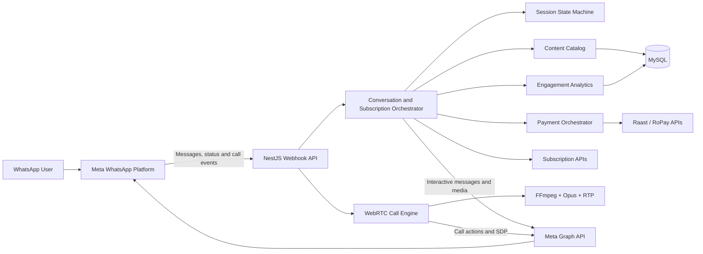

<div align="center">

# Bajao WhatsApp Experience

### A conversational entertainment, subscription, and payment platform built on WhatsApp


</div>

## Overview

Bajao WhatsApp Experience is a production-oriented backend that brings music discovery, premium subscriptions, and digital payments into a conversational WhatsApp journey. It routes each user through explicit consent, language selection, category browsing, and a payment workflow that culminates in a premium listening experience.

The platform also supports interactive WhatsApp voice calls. It negotiates WebRTC sessions, streams Opus audio in real time, and lets listeners navigate tracks with DTMF keypad controls.

## Key Features

- **Conversational subscription funnel** — guides users from first contact through consent, payment, activation, and the subscribed experience.
- **Free and premium content discovery** — browsable categories, paginated track lists, shuffled recommendations, artwork, audio, and "more tracks" navigation.
- **Interactive WhatsApp messages** — text, media, templates, reply buttons, lists, call-to-action links, delivery tracking, and read receipts.
- **Real-time voice experience** — WhatsApp Calling API integration with WebRTC negotiation, FFmpeg decoding, Opus encoding, RTP streaming, and DTMF track controls.
- **Raast payment orchestration** — token management, account-title lookup, request-to-pay initiation, callback processing, verification, and subscription activation.
- **Subscription-aware routing** — resolves membership status and directs users to free, payment, suspended, or premium experiences.
- **Bilingual journeys** — configurable English and Roman Urdu messaging with per-session language selection.
- **Engagement analytics** — event timelines, unique-user metrics, funnel reporting, and daily activity summaries without storing message bodies.
- **Operational automation** — scheduled payment reminders, timeout handling, SQL migrations, health checks, and container startup workflows.

## Technology Stack

**Backend**

- Node.js 20
- NestJS 10
- TypeScript
- Express
- RxJS

**Data and integrations**

- MySQL
- TypeORM with repository-based data access
- Meta Graph API and WhatsApp Cloud API
- WhatsApp Calling API
- Raast/RoPay payment services
- External subscription and content services

**Real-time media**

- WebRTC via `werift`
- RTP and RFC 4733 DTMF processing
- Opus audio via `@discordjs/opus`
- FFmpeg media decoding and resampling

**Quality and delivery**

- Jest and Supertest
- ESLint, Prettier, and CSpell
- class-validator and class-transformer
- Swagger / OpenAPI
- Docker multi-stage builds
- Azure Pipelines
- Husky Git hooks

## Architecture



The codebase follows a modular NestJS design. Controllers receive and validate external events, orchestration services select the correct business flow, focused services handle messaging, payments, content, and analytics. Dependencies are injected across loosely coupled modules, encouraging testability and maintainability.

## Engineering Highlights

### State-driven user journeys

The conversation layer models explicit user and subscription states rather than relying on isolated keyword handlers. Dedicated routers coordinate consent, language selection, free browsing, payment initiation, and premium content access. Each state knows its valid transitions and can conditionally guide users toward reengagement or churn recovery.

### Reliable webhook processing

- HMAC-SHA256 verification for Meta webhook payloads
- Timing-safe payment callback authentication
- Message ID deduplication for webhook retries
- Outbound delivery-status tracking
- Input validation through global NestJS pipes
- Centralized exception handling and masked identifiers in logs

### Real-time audio pipeline

Inbound calls are negotiated using SDP and WebRTC. Track audio from configured URLs is decoded by FFmpeg, encoded into Opus frames, paced into RTP packets, and written to the active media track. DTMF events (keypad presses) are parsed and routed as track navigation commands.

### Maintainable content and messaging

User-facing copy can be loaded from JSON configuration, supports language-specific variants and template variables, and retains typed defaults. Content is stored in MySQL and exposed through repository-based data access, making runtime updates and A/B testing straightforward.

## Project Structure

```text
src/
├── common/                 # Guards, filters, DTOs, helpers, and shared services
├── config/                 # Application configuration
├── database/
│   ├── entities/           # TypeORM data models
│   └── repositories/       # Repository-based data access
├── modules/
│   ├── auth/               # Authentication
│   ├── campaigns/          # Campaign APIs
│   ├── health-check/       # Service health endpoint
│   ├── users/              # User management
│   └── webhook/            # WhatsApp, payments, content, calls, and analytics
├── seed/                   # Initial application data
├── app.module.ts           # Root dependency graph
└── main.ts                 # Bootstrap, validation, CORS, and Swagger

config/                     # Configurable bilingual messages
migrations/                 # Versioned MySQL migrations and seed data
public/                     # Public media assets
scripts/                    # Local migration and integration utilities
```

## Getting Started

### Prerequisites

- Node.js 18 or newer
- Yarn
- MySQL
- MySQL or MariaDB command-line client for migrations
- FFmpeg for WhatsApp call audio playback

### Installation

```bash
git clone <repository-url>
cd whatsapp_fst
yarn install
```

Create a `.env` file with the core application settings:

```dotenv
NODE_ENV=development
BACKEND_PROTOCOL=http
BACKEND_HOST=localhost
BACKEND_PORT=3000

DATABASE_HOST=localhost
DATABASE_PORT=3306
DATABASE_USERNAME=root
DATABASE_PASSWORD=your_password
DATABASE_NAME=bajao
DATABASE_TIMEZONE=Z

TOKEN_SECRET=replace_with_a_strong_secret

META_API_TOKEN=your_meta_api_token
META_VERIFY_TOKEN=your_webhook_verify_token
META_APP_SECRET=your_meta_app_secret
BUSINESS_PHONE_NUMBER_ID=your_phone_number_id
WA_TEMPLATE_LANGUAGE=en

PUBLIC_BASE_URL=http://localhost:3000
AUDIO_DELIVERY_MODE=vm
```

Payment, subscription, and call settings are environment-driven, so integration credentials and endpoint URLs can be supplied independently for each deployment.

Run the migrations and start the development server:

```bash
yarn db:migrate
yarn start:dev
```

The API starts at `http://localhost:3000`. Interactive Swagger documentation is available in non-production environments at:

```text
http://localhost:3000/docs
```

## Main API Routes

- `GET /health-check/v1/check-server` — service health check
- `GET /webhook` — Meta webhook verification
- `POST /webhook` — inbound WhatsApp messages, delivery statuses, and call events
- `GET /call-events` — WhatsApp Calling webhook verification
- `POST /call-events` — dedicated calling event callback
- `POST /payment-callback` — payment result processing
- `GET /webhook/stats` — paginated engagement events
- `GET /webhook/engagement/report` — engagement and funnel summary
- `POST /auth/login` — user authentication

## Available Commands

```bash
yarn start:dev     # Start with hot reload
yarn build         # Build the production bundle
yarn prod          # Run the compiled application
yarn test          # Run unit tests
yarn test:cov      # Run tests with coverage
yarn test:e2e      # Run end-to-end tests
yarn lint          # Check code quality
yarn lint:fix      # Apply safe lint fixes
yarn format        # Format TypeScript sources
yarn spell         # Check project spelling
yarn db:migrate    # Apply MySQL migrations
```

## Deployment

The multi-stage Docker build compiles the NestJS application in a dedicated build stage and produces a smaller Alpine-based runtime image. The container includes FFmpeg and a MariaDB client, applying migrations during startup and running the application in production mode.

Azure Pipelines automates container image builds and registry publishing. Runtime configuration is injected through environment variables, making the service suitable for container orchestration platforms like Kubernetes or ACI.

## Testing Strategy

The Jest suite covers payment callback normalization, webhook signature verification, configurable messages, payment expiry rules, SDP normalization, call event parsing, DTMF inspection, and RTP stream validation. End-to-end tests validate full conversation flows, payment acceptance, and state transitions.

---

<div align="center">
Built with NestJS, TypeScript, MySQL, and the WhatsApp Cloud Platform.
</div>